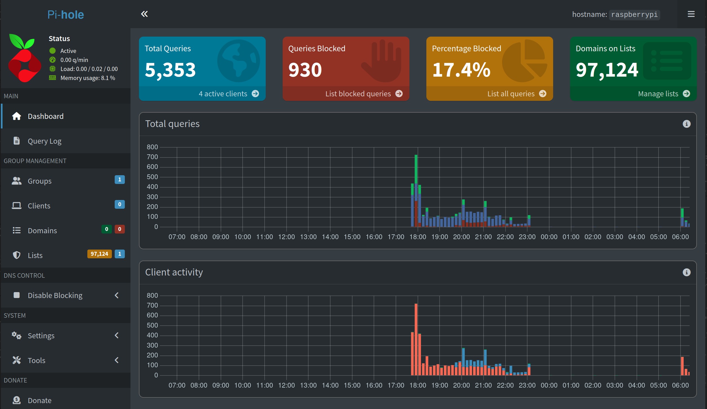
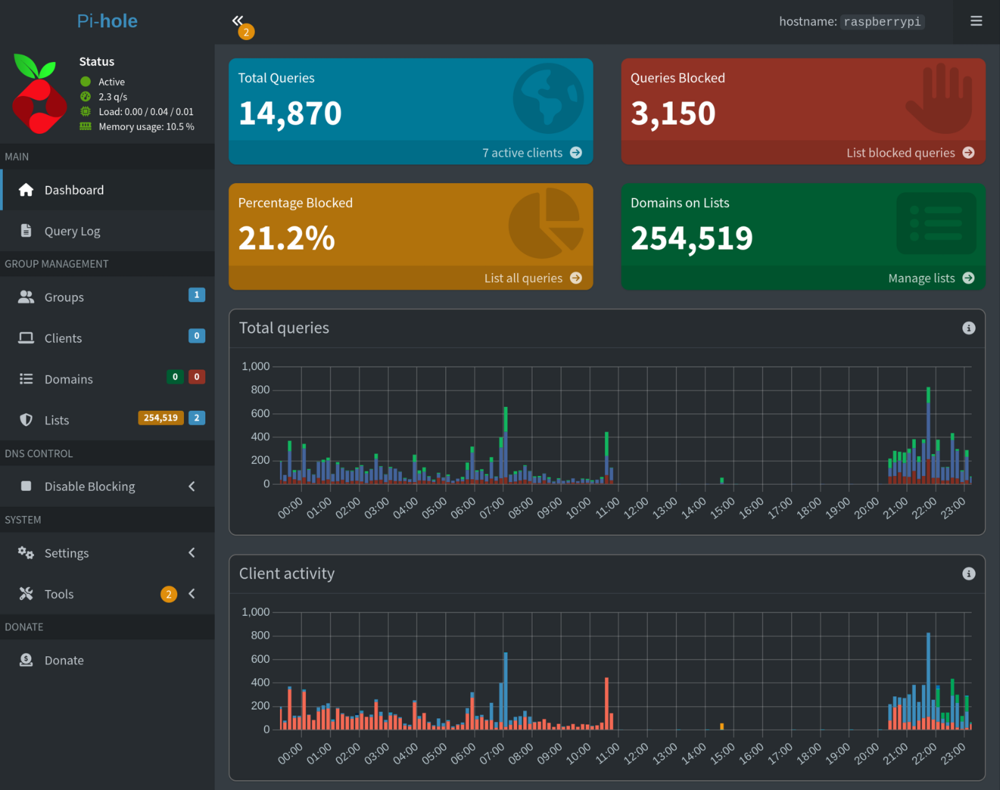

# Pi-hole Setup Guide

## Overview

**What is Pi-hole?**
Pi-hole is a DNS sinkhole that runs on a Raspberry Pi, blocking ads and trackers at the network level. It sits between your devices and DNS servers, filtering requests against block lists before forwarding legitimate queries.

[Official Reference](https://www.raspberrypi.com/tutorials/running-pi-hole-on-a-raspberry-pi/)

[Pi-Hole](https://pi-hole.net/)

---

## Hardware & Software Used

- **Device**: Raspberry Pi 2 Model B
- **OS**: Raspberry Pi OS Lite (32-bit) - Debian Trixie without desktop environment
- **Setup Environment**: Ubuntu Linux desktop

---

## Step 1: Prepare Your System

Update your Ubuntu system and install the Raspberry Pi Imager:

```bash
sudo apt update
sudo apt install rpi-imager
```

Launch the imager:

```bash
rpi-imager
```

---

## Step 2: Configure the SD Card

**Imager Settings:**
- Device: Raspberry Pi 2 Model B
- OS: Raspberry Pi OS Lite (32-bit)

After flashing, the SD card will be mounted on your system. Locate the mount point:

```bash
ls /media/tigris/
# Look for "bootfs"
```

Enable SSH by creating an empty ssh file:

```bash
touch /media/tigris/bootfs/ssh
```

Safely eject the SD card:

```bash
sudo umount /media/tigris/bootfs
sudo umount /media/tigris/rootfs
```

---

## Step 3: Connect to Your Raspberry Pi

Insert the SD card into your Pi and power it on. Scan your network to find the Pi's IP address:

```bash
sudo nmap -sn 192.168.1.0/24
# The -sn flag performs a "ping scan" (no port scan)
# This quickly discovers which hosts are online without scanning their ports
# Look for "Rivet Networks" or "Raspberry Pi"
```

For the rest of this example, we will use the IP address 192.168.1.222 --> This address will likely be different for your own device.

Connect via SSH:

```bash
ssh username@192.168.1.222
# Enter your password when prompted
```

---

## Step 4: Install Pi-hole

Run the Pi-hole installer:

```bash
curl -sSL https://install.pi-hole.net | bash
# The -s flag runs curl in silent mode (no progress bar)
# The -S flag shows errors even in silent mode
# The -L flag follows redirects if the URL has moved
# The | bash pipes the downloaded script directly to bash for execution
```

Follow the automated installer prompts with these configurations:
- **DNS Provider**: Cloudflare
- **Block List**: StevenBlack's Unified Hosts List (default)
- **Query Logging**: Enabled
- **Privacy Level**: (0) Show Everything

---

## Step 5: Configure Static IP

Set a static IP address for your Pi:

```bash
sudo nmcli connection modify "Wired connection 1" ipv4.addresses 192.168.1.222/24 ipv4.gateway 192.168.1.1 ipv4.dns "8.8.8.8,8.8.4.4" ipv4.method manual
sudo nmcli connection down "Wired connection 1" && sudo nmcli connection up "Wired connection 1"
```

**Command Explanation:**

**First Command - Configure Network Settings:**
- `sudo nmcli connection modify "Wired connection 1"` - Modifies the network connection named "Wired connection 1" with root privileges
- `ipv4.addresses 192.168.1.222/24` - Sets the static IP address to 192.168.1.222 with a subnet mask of 255.255.255.0 (/24)
- `ipv4.gateway 192.168.1.1` - Sets the default gateway (your router's IP address)
- `ipv4.dns "8.8.8.8,8.8.4.4"` - Sets DNS servers to Google's public DNS (used as fallback)
- `ipv4.method manual` - Changes from DHCP (automatic) to manual IP configuration

**Second Command - Apply Changes:**
- `sudo nmcli connection down "Wired connection 1"` - Disconnects the network interface
- `&&` - Executes the next command only if the first succeeds
- `sudo nmcli connection up "Wired connection 1"` - Reconnects the network interface with the new settings

---

## Step 6: Set Admin Password

Configure your Pi-hole admin password:

```bash
sudo pihole setpassword
```

---

## Step 7: Configure Your Router

Set your router's DNS server to point to your Pi's IP address (192.168.1.222). This ensures all devices on your network use Pi-hole for DNS queries.

**Note**: The Raspberry Pi is connected to the router via Ethernet (RJ45) for stable connectivity.

Access the Pi-hole admin console by navigating to:
```
http://192.168.1.222/admin
```

---

## Result

✅ Pi-hole is now running and blocking ads across your network!



Update 12/9/25: 
- Everything is going smoothly! I have added the [HaGeZi's Pro DNS Blocklist](https://gitlab.com/hagezi/mirror/-/raw/main/dns-blocklists/adblock/pro.txt) which added 173,118 blocked domains to the total.
- This project has significantly sped up my internet experience at home.


